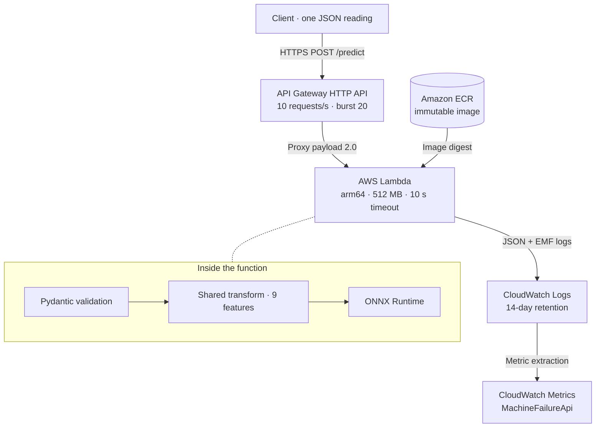

<div align="center">

<p><strong>APPLIED MACHINE LEARNING · SERVERLESS INFERENCE · AWS</strong></p>

# Machine Failure API

### From machine signals to traceable failure decisions.

A predictive maintenance classifier delivered as an observable, versioned HTTPS service.

<p>
  
  
  
  
</p>

**[Architecture](#architecture)** · **[Engineering decisions](#design-decisions)** · **[API contract](#api)** · **[Reproduce](#reproduce)** · **[Build evidence](#build-log)**

</div>

---

The service scores one machine reading using a gradient boosting classifier trained on the **UCI AI4I 2020 predictive maintenance dataset**. Each response includes a **failure probability**, **boolean flag**, **decision threshold**, and **model version**.

The engineering focus is the complete model-to-service boundary: shared feature construction, a numerical parity gate for ONNX export, immutable container artifacts, input validation, and measured serving behavior. Inference runs on AWS Lambda in an arm64 container behind an API Gateway HTTP API. The runtime image contains neither pandas nor scikit-learn.

> **Explore the visual case study:** Open [`docs/index.html`](docs/index.html) locally for the portfolio presentation and three interactive Archify diagrams. GitHub displays HTML source; download or clone the repository to use the viewers in a browser.

## Results

| Model quality | Failure detection | Warm execution | Variable serving cost |
| :--- | :--- | :--- | :--- |
| **0.9315** average precision | **92.16%** test recall | **2.50 ms** Lambda p50 | **$1.84** / million warm requests |
| Held-out test partition | 60.26% precision at the tuned threshold | 10.84 ms p99 · 120 requests | Recorded estimate, before free tier |

<details>
<summary><strong>Measurement scope and supporting numbers</strong></summary>

| Measure | Recorded result | Interpretation |
| :--- | :--- | :--- |
| Maximum ONNX / scikit-learn probability difference | `1.16e-07` | Below the `1e-3` export tolerance |
| Cold initialization | 699 ms mean · 1172 ms maximum | Five forced cold starts |
| API Gateway latency | 71.6 ms p50 | Different measurement boundary from Lambda duration |
| Client round trip | 334 ms warm p50 | Laptop over the internet |
| Maximum memory used | 130 MB / 512 MB | Observed during the measurement run |
| Container image | 236.7 MB compressed · 711 MB unpacked | Runtime dependencies and Lambda base image |

Model metrics come from [`model/metadata.json`](model/metadata.json). Serving measurements and the historical cost estimate are recorded in [Gate 6](#gate-6-measurement), September 27, 2026, in `us-east-2`. Cost excludes fixed metric and storage charges. These observations are not an SLO or a claim of current pricing.

</details>

## Architecture

[](docs/diagrams/system-architecture.html)

**Request path:** `POST /predict` → Pydantic validation → shared feature transform → ONNX Runtime → threshold decision → versioned JSON response.

The ONNX session loads once per execution environment and is reused by warm invocations. API Gateway invokes the function through a route-scoped resource policy. The Lambda execution role uses `AWSLambdaBasicExecutionRole`; custom metrics are emitted as Embedded Metric Format logs and extracted by CloudWatch.

| Explore the system | What the diagram explains |
| :--- | :--- |
| [System architecture](docs/diagrams/system-architecture.html) | API Gateway, Lambda, image provenance, and CloudWatch telemetry |
| [Training pipeline](docs/diagrams/training-pipeline.html) | Feature construction, stratified partitions, threshold selection, and verified export |
| [Inference path](docs/diagrams/inference-path.html) | Validation, scoring, the 422 branch, and initialization safeguards |

The linked HTML viewers support light/dark themes, search, tracing, zoom, and export. Editable specifications and regeneration instructions live in [`docs/`](docs/README.md).

<details>
<summary><strong>Text-based architecture reference</strong></summary>



</details>

## Design decisions

| Boundary | Implementation | Engineering rationale |
| :--- | :--- | :--- |
| **Training ↔ serving** | One NumPy-only [`features.py`](features.py) module | Reuse the same transform and ordered float32 representation across both contexts. |
| **Estimator ↔ runtime** | ONNX export with a probability parity assertion | Keep training libraries out of the runtime while detecting numerical divergence above the allowed tolerance. |
| **Artifact ↔ handler** | Startup comparison of metadata and `FEATURE_ORDER` | Fail before serving if the model's feature ordering does not match the handler. |
| **Score ↔ decision** | Highest validation threshold satisfying recall ≥ 0.90 | Make the missed-failure versus false-alarm tradeoff explicit; evaluate it on held-out test data. |
| **Input ↔ inference** | Pydantic bounds, type checks, and cross-field validation | Reject invalid readings and unknown fields with a structured HTTP 422 response. |
| **Build ↔ deployment** | Build-input hash tags, immutable ECR images, digest-based deployment | Identify the exact runtime artifact; skip redundant image builds and unnecessary configuration updates. |
| **Runtime ↔ telemetry** | Powertools structured logs and EMF | Track predictions, flagged failures, rejected inputs, and inference latency without direct metric API calls. |
| **Public API ↔ traffic** | Stage throttle: 10 requests/s, burst 20 | Limit request throughput on the unauthenticated endpoint; throttling is not authentication. |

## Dataset limitation

[UCI describes AI4I 2020](https://archive.ics.uci.edu/dataset/601/ai4i+2020+predictive+maintenance+dataset) as a synthetic dataset reflecting industrial predictive maintenance conditions. Many failure labels are generated from rules over the available inputs; this makes benchmark performance easier to achieve than generalization to a factory fleet. Random failures have no predictive relationship to those inputs.

The held-out test partition contains **51 failures**, so one missed failure moves recall by approximately two percentage points. These results demonstrate the benchmark and serving pipeline. Field deployment would require site-specific data, temporal validation, calibration assessment, and distribution-shift monitoring.

## API

### `POST /predict`

**Request — one machine reading**

```json
{
  "type": "M",
  "air_temp_k": 298.1,
  "process_temp_k": 308.6,
  "rotational_speed_rpm": 1551,
  "torque_nm": 42.8,
  "tool_wear_min": 0
}
```

**Response — HTTP 200**

```json
{
  "failure_probability": 0.0013,
  "failure": false,
  "threshold": 0.0536,
  "model_version": "20260927-c55438f1"
}
```

Example values are rounded for display. The flag is computed as `failure_probability >= threshold`; each response identifies the model version and decision policy.

<details>
<summary><strong>Validation contract · HTTP 422 on invalid input</strong></summary>

| Field | Accepted values |
| :--- | :--- |
| `type` | `L`, `M`, or `H` |
| `air_temp_k` | 250–350 K |
| `process_temp_k` | 250–400 K; must be ≥ air temperature |
| `rotational_speed_rpm` | > 0 and ≤ 5000 rpm |
| `torque_nm` | 0–150 Nm |
| `tool_wear_min` | 0–400 min |

Unknown fields are rejected. The handler returns structured validation errors and emits the `InvalidReadings` metric.

</details>

## Reproduce

**Prerequisites:** Python 3.12, Docker with arm64 support, and AWS CLI v2.

**1. Train, export, and test locally**

```bash
git clone https://github.com/abh2050/machine-failure-api-aws-ECR.git
cd machine-failure-api-aws-ECR
python3.12 -m venv .venv
.venv/bin/pip install -r requirements-dev.txt
.venv/bin/python train.py
.venv/bin/pytest -q
```

**2. Authenticate and deploy**

```bash
aws login --profile <your-profile>
AWS_PROFILE=<your-profile> ./deploy.sh
```

**3. Measure the deployed service**

```bash
AWS_PROFILE=<your-profile> ./measure.sh
```

`deploy.sh` resolves the account ID at runtime and targets `us-east-2`. To use another region, update `REGION` in both scripts. `measure.sh` sends live requests and temporarily changes the function configuration to force cold starts. [Resource inventory and cleanup commands](RESOURCES.md) are documented separately.

**4. Open the visual documentation**

Open [`docs/index.html`](docs/index.html) directly in a browser. Diagram and photograph assets are included locally; optional web fonts fall back to system fonts offline.

## Repository layout

| Path | Responsibility |
| :--- | :--- |
| [`docs/`](docs/README.md) | Visual case study, interactive diagrams, editable specifications, and validation evidence |
| [`features.py`](features.py) | Shared feature construction; NumPy only |
| [`train.py`](train.py) | Dataset loading, training, threshold tuning, evaluation, export, and parity check |
| [`model/`](model/) | ONNX model and versioned metadata bundled into the image |
| [`app.py`](app.py) | Input validation, inference, response contract, and telemetry |
| [`tests/test_app.py`](tests/test_app.py) | Handler tests using HTTP API event payloads |
| [`Dockerfile`](Dockerfile) | Python 3.12 Lambda runtime image with a digest-pinned base |
| [`deploy.sh`](deploy.sh) | Resource creation and conditional deployment updates |
| [`measure.sh`](measure.sh) | Cold/warm latency, CloudWatch metrics, and variable cost measurement |
| [`events/`](events/) | Valid and invalid HTTP API event examples |
| [`RESOURCES.md`](RESOURCES.md) | AWS resource inventory and deletion commands |
| [`requirements.txt`](requirements.txt) | Pinned runtime dependencies |
| [`requirements-dev.txt`](requirements-dev.txt) | Training and test dependencies |
| [`CLAUDE.md`](CLAUDE.md) | AI pair-programming working instructions |

## What each gate taught

| Gate | Evidence | Engineering takeaway |
| :--- | :--- | :--- |
| [01 · Training](#gate-1-features-and-training) | Held-out metrics and ONNX parity | Treat model conversion as a numerical correctness boundary. |
| [02 · Handler](#gate-2-handler-and-tests) | Event-based tests and validation | Test the real integration contract, including rejected inputs. |
| [03 · Container](#gate-3-container-image) | Local runtime emulator checks | Exercise the packaged runtime before deployment. |
| [04 · Infrastructure](#gate-4-ecr-iam-role-and-lambda-function) | ECR, IAM, and Lambda commands | Account-level policy and IAM propagation affect deployment. |
| [05 · HTTP API](#gate-5-http-api) | Public route and proxy integration | Function invoke permission is separate from the execution role. |
| [06 · Measurement](#gate-6-measurement) | Latency, memory, metrics, and cost | Gateway and log ingestion dominate the measured variable cost. |
| [07 · Failure drills](#gate-7-failure-drills) | Invalid input, missing permission, feature mismatch | Failures at different boundaries leave different observability signals. |

---

## Build log

Account IDs and API IDs are replaced with `<account-id>` and `<api-id>` in all output below.

### Gate 1: features and training

`features.py` builds nine features in a fixed order. Three of them are derived: mechanical power in watts (torque times angular velocity), the difference between process and air temperature, and the product of torque and tool wear, which the generator uses for overstrain failures.

`train.py` splits the 10,000 rows 70/15/15 with stratification and seed 42. It trains a `GradientBoostingClassifier` with default settings. It then picks the highest threshold that still reaches recall of 0.90 on the validation split, which gives the best precision at that recall. Finally it exports the model to ONNX with zipmap disabled.

```
$ python train.py
rows=10000 failures=339 failure_rate=0.0339
train=7000 val=1500 test=1500
threshold=0.0536 test={'pr_auc': 0.9315, 'recall': 0.9216, 'precision': 0.6026}
onnx_parity_max_abs_diff=1.16e-07
wrote model/model.onnx and model/metadata.json version=20260927-c55438f1
```

The ONNX model and the scikit-learn model agree to within 1.16e-07 on every test probability, far inside the 1e-3 tolerance. The test split holds only 51 failures, so each missed failure moves recall by about two points. The model version combines the UTC date with the first eight characters of the ONNX file hash.

### Gate 2: handler and tests

`app.py` uses the AWS Lambda Powertools HTTP API resolver with validation enabled, so the Pydantic `Reading` model checks the body before the route runs. The handler loads the ONNX session once per container and raises an error at startup when the feature order in `metadata.json` differs from `features.py`. Each request writes a structured JSON log line and CloudWatch metrics in Embedded Metric Format: `Predictions`, `FailuresFlagged`, `InferenceLatency`, and `InvalidReadings`.

```
$ pytest -q
........                                                                 [100%]
8 passed in 0.34s
```

The tests cover a valid reading, six implausible readings that each return 422, and a check that high torque with a worn tool scores higher than a healthy reading. Locally, the healthy reading scored 0.0013 and the stressed reading scored 0.9966.

### Gate 3: container image

The image installs only `requirements.txt`, and a `.dockerignore` allow list admits only the five files the image needs.

```
$ docker build --platform linux/arm64 --provenance=false -t machine-failure-api:local .
$ docker image inspect machine-failure-api:local --format '{{.Size}}'
236731373
```

The 237 MB figure is the compressed size, and it matches the size that ECR reports in Gate 6. The image unpacks to 711 MB, and the application directory `/var/task` accounts for 147 MB of that (onnxruntime 59 MB, numpy with its bundled libraries 68 MB). The AWS base image supplies the rest. An import check inside the container confirmed that scikit-learn, pandas, and skl2onnx are absent.

The Lambda base image includes the Runtime Interface Emulator, which accepts invocations on port 8080. The container ran with that port mapped to 9000.

```
$ curl -X POST http://localhost:9000/2015-03-31/functions/function/invocations -d @events/predict_valid.json
{"statusCode": 200, "body": "{\"failure_probability\":0.0013143420219421387,\"failure\":false,\"threshold\":0.05364711871521085,\"model_version\":\"20260927-c55438f1\"}", ...}

$ curl -X POST http://localhost:9000/2015-03-31/functions/function/invocations -d @events/predict_invalid.json
{"statusCode": 422, "body": "{\"message\": \"invalid reading\", \"errors\": [{\"loc\": [\"body\", \"torque_nm\"], \"msg\": \"Input should be less than or equal to 150\", \"type\": \"less_than_equal\"}]}", ...}

INIT REPORT(durationMs: 194.698000)
REPORT RequestId: ... Duration: 0.72 ms  Billed Duration: 1 ms
```

### Gate 4: ECR, IAM role, and Lambda function

`deploy.sh` creates an ECR repository with immutable tags, scan on push, and a lifecycle rule that keeps the five newest images. It tags each image with a hash of the build inputs, so an unchanged tree skips the build and push. It creates an execution role that only `lambda.amazonaws.com` can assume, with `AWSLambdaBasicExecutionRole` as its only policy. It creates the log group ahead of the function so that the group carries project tags and a 14 day retention period. Finally, it deploys the function by image digest rather than by tag.

Two problems surfaced before the deploy succeeded.

1. The first run failed with `Bad CPU type in executable`. A non-interactive bash shell found an old x86_64 build of the AWS CLI at `/usr/local/bin/aws` before the arm64 build in `~/.local/bin`. The script now checks that the CLI runs and prints the real error when the credential check fails.
2. The second run failed with `AccessDeniedException ... ecr:CreateRepository ... with an explicit deny in a service control policy`. A service control policy is an AWS Organizations guardrail that caps what any role in a member account can do, and an explicit deny in one overrides even an administrator role. This account is limited to us-east-2, so the project moved from us-west-2 to us-east-2.

```
$ ./deploy.sh
==> ECR repository machine-failure-api
created
==> Image machine-failure-api:720900bb9da2
Login Succeeded
720900bb9da2: digest: sha256:a0522985f0fb62ffd70271f7369883b9b7dc9274966a4833ecf557a84928da91 size: 2271
==> IAM role machine-failure-api-lambda-role
created
==> Log group /aws/lambda/machine-failure-api
created
==> Lambda function machine-failure-api
role not ready yet, retrying in 10s
created
```

A new IAM role takes a few seconds to propagate, so the first `create-function` call was refused and the retry loop succeeded ten seconds later.

```
$ aws lambda invoke --region us-east-2 --function-name machine-failure-api \
    --cli-binary-format raw-in-base64-out --payload fileb://events/predict_valid.json --log-type Tail out.json
StatusCode 200
REPORT Duration: 19.45 ms  Billed Duration: 3536 ms  Memory Size: 512 MB  Max Memory Used: 122 MB  Init Duration: 3516.31 ms
{"statusCode": 200, "body": "{\"failure_probability\":0.0013143420219421387,\"failure\":false,...}"}

$ aws lambda invoke ... --payload fileb://events/predict_invalid.json ...
StatusCode 200
REPORT Duration: 2.31 ms  Billed Duration: 3 ms  Memory Size: 512 MB  Max Memory Used: 122 MB
{"statusCode": 422, "body": "{\"message\": \"invalid reading\", ...}"}
```

The outer `StatusCode 200` means that Lambda ran the function. The HTTP status sits inside the payload. The 3.5 second Init Duration came from the first start of a new image and is measured properly in Gate 6.

### Gate 5: HTTP API

`deploy.sh` creates an HTTP API with a Lambda proxy integration (payload format 2.0), a `POST /predict` route, and a `$default` stage with automatic deployment. The endpoint has no authentication, so the stage throttles traffic to 10 requests per second with a burst of 20, which caps how fast anyone can generate cost. A resource based policy on the function lets API Gateway invoke it, and its source ARN limits that permission to this API, the POST method, and the `/predict` path.

```
$ ./deploy.sh
==> HTTP API machine-failure-api
created
==> Lambda proxy integration
created
==> Route POST /predict
created
==> Stage $default (auto deploy, throttled)
created
==> Invoke permission for API Gateway
created
Predict URL: https://<api-id>.execute-api.us-east-2.amazonaws.com/predict
```

```
$ curl -X POST https://<api-id>.execute-api.us-east-2.amazonaws.com/predict -d '{"type":"M","air_temp_k":298.1,"process_temp_k":308.6,"rotational_speed_rpm":1551,"torque_nm":42.8,"tool_wear_min":0}'
HTTP/2 200
{"failure_probability":0.0013143420219421387,"failure":false,"threshold":0.05364711871521085,"model_version":"20260927-c55438f1"}

$ curl ... -d '{"type":"L","air_temp_k":301.0,"process_temp_k":310.5,"rotational_speed_rpm":1380,"torque_nm":65.0,"tool_wear_min":220}'
HTTP/2 200
{"failure_probability":0.9967771172523499,"failure":true,"threshold":0.05364711871521085,"model_version":"20260927-c55438f1"}

$ curl ... -d '{"type":"M","air_temp_k":298.1,"process_temp_k":290.0,"rotational_speed_rpm":1551,"torque_nm":42.8,"tool_wear_min":0}'
HTTP/2 422
{"message": "invalid reading", "errors": [{"loc": ["body"], "msg": "Value error, process_temp_k must be greater than or equal to air_temp_k", "type": "value_error"}]}

$ curl ... -d '{"type":'
HTTP/2 422
{"message": "invalid reading", "errors": [{"loc": ["body", 8], "msg": "JSON decode error", "type": "json_invalid"}]}

$ curl https://<api-id>.execute-api.us-east-2.amazonaws.com/predict
HTTP/2 404
{"message":"Not Found"}
```

API Gateway answers the GET request with 404 on its own, because no route matches it, so the function never runs. A second run of `deploy.sh` reported every resource as existing and changed nothing.

### Gate 6: measurement

`measure.sh` measures the live service and creates no resources. It forces five cold starts by changing an environment variable before each request, because any configuration change makes Lambda discard its warm environments. It then sends 100 warm valid requests, 10 stressed requests, and 10 invalid requests at under 7 requests per second, which stays below the stage throttle. It reads the Lambda `REPORT` lines through CloudWatch Logs Insights, reads the metrics through `get-metric-data`, and prices the result with on-demand us-east-2 rates from the AWS Pricing API.

#### Summary

| Measure | Value |
|---|---|
| Image size in ECR (compressed) | 236.7 MB |
| Image size unpacked | 711 MB, of which the application and its packages take 147 MB |
| Cold start Init Duration | 699 ms average and 1172 ms maximum over 5 forced cold starts |
| Cold start billed duration | 709 ms average, because container image functions bill the init phase |
| Warm Lambda Duration | 2.50 ms p50, 2.94 ms average, 10.84 ms p99 over 120 requests |
| Warm billed duration | 3.46 ms average |
| ONNX inference inside the handler | 2.83 ms p99 (`InferenceLatency` metric) |
| Maximum memory used | 130 MB of 512 MB |
| API Gateway latency | 71.6 ms p50, and 32.1 ms p50 of that is the Lambda integration |
| Client round trip from a laptop over the internet | 334 ms p50 warm, 1016 ms p50 cold |
| Log volume | 1229 bytes per invocation |
| Cost per million warm requests | 1.84 USD before the free tier |

#### Cost per million warm requests

| Item | Price used | USD per million requests |
|---|---|---|
| API Gateway HTTP API requests | 1.00 USD per million | 1.0000 |
| Lambda requests | 0.20 USD per million | 0.2000 |
| Lambda duration, arm64, 512 MB, 3.46 ms billed | 0.0000133334 USD per GB second | 0.0231 |
| CloudWatch Logs ingestion, 1229 bytes per request | 0.50 USD per GB | 0.6147 |
| Total | | 1.8377 |

The model itself costs almost nothing to run. The API Gateway request charge makes up more than half of the bill, and log ingestion is the second largest item, costing about 27 times more than the compute. The cheapest way to reduce cost would be to drop the per request `scored reading` log line or to sample it, since the EMF metrics already carry the counts. A cold start adds 709 billed ms, which costs 0.0000047 USD, so cold starts matter for latency rather than for cost.

Two costs do not scale with requests. CloudWatch charges 0.30 USD per custom metric per month, and the service emits four custom metrics, which comes to 1.20 USD per month. ECR storage for one 0.24 GB image costs about 0.02 USD per month at 0.10 USD per GB month.

#### Raw output

```
$ ./measure.sh
==> 5 forced cold starts
200 4.834939
200 1.127911
200 0.989843
200 0.989898
200 1.016292
==> 100 warm requests plus 10 stressed and 10 invalid
client cold     n=5   status=200 p50= 1016.3 ms  p95= 4093.5 ms  max= 4834.9 ms
client warm     n=100 status=200 p50=  333.8 ms  p95=  353.8 ms  max=  408.2 ms
client stressed n=10  status=200 p50=  335.2 ms  p95=  344.3 ms  max=  348.4 ms
client invalid  n=10  status=422 p50=  333.1 ms  p95=  348.8 ms  max=  348.9 ms
==> Lambda REPORT statistics (Logs Insights)
lambda warm: n=120 duration avg=2.94 ms p50=2.50 ms p99=10.84 ms billed avg=3.46 ms max memory=130 MB
lambda cold: n=5 duration avg=9.97 ms p50=6.57 ms p99=18.92 ms billed avg=709.00 ms max memory=124 MB init avg=699 ms init max=1172 ms
log volume: 685 events, 153663 bytes, 1229 bytes per invocation
cost per million warm requests (USD, before free tier):
  API Gateway HTTP API requests      1.0000
  Lambda requests                    0.2000
  Lambda duration (warm, 512 MB)     0.0231
  CloudWatch Logs ingestion          0.6147
  total                              1.8377
one cold start bills 709 ms, which costs 0.00000473 USD
==> CloudWatch metrics over the measurement window
predictions             119.0
flagged                 11.0
invalid                 13.0
inference_p99_ms        2.8291547016249643
lambda_invocations      126.0
lambda_errors           0.0
lambda_throttles        0.0
api_count               104.0
api_4xx                 4.0
api_5xx                 0.0
api_latency_p50_ms      71.63588590971813
api_integration_p50_ms  32.13505063003849
```

#### Reading the numbers

The client round trip of 334 ms is mostly network distance and a fresh TLS handshake for every curl call, because the function itself finishes in about 3 ms. The first forced cold start took 4.8 seconds at the client while its Init Duration was only 1.2 seconds. Lambda spends the remaining time loading the image into a new execution environment, and Init Duration does not include that step. The Gate 4 cold start of 3.5 seconds happened on the first run of a new image, before Lambda had cached its layers.

The metric sums use one hour buckets, so they also count requests from Gate 5. The `api_count` value of 104 is lower than the 126 Lambda invocations because API Gateway metrics were still arriving when the script stopped polling. The script stops once the custom `Predictions` metric covers the warm traffic. Lambda reported zero errors and zero throttles.

### Gate 7: failure drills

Each drill breaks one thing on purpose, records what the client and the logs showed, and then restores the service.

#### Drill 1: invalid input

Three malformed readings went to the public URL. Each one returned 422 with the exact field and error type, and the function stayed healthy.

```
== unknown machine type
{"message": "invalid reading", "errors": [{"loc": ["body", "type"], "msg": "Input should be 'L', 'M' or 'H'", "type": "literal_error"}]}
HTTP 422
== missing field
{"message": "invalid reading", "errors": [{"loc": ["body", "tool_wear_min"], "msg": "Field required", "type": "missing"}]}
HTTP 422
== string in a number
{"message": "invalid reading", "errors": [{"loc": ["body", "air_temp_k"], "msg": "Input should be a valid number, unable to parse string as a number", "type": "float_parsing"}]}
HTTP 422
```

A Logs Insights query for `message = "rejected reading"` returned one WARNING line per request, and each line carried the field name, the error type, and the Lambda request ID.

| Level | Field | Error type |
|---|---|---|
| WARNING | type | literal_error |
| WARNING | tool_wear_min | missing |
| WARNING | air_temp_k | float_parsing |

Each rejection also emitted one `InvalidReadings` metric. The Lambda `Errors` metric did not move, because a rejected reading is a handled response and not a function failure.

#### Drill 2: missing permission

This drill removes the resource based policy statement that lets API Gateway invoke the function. The API, route, integration, and function all stay in place.

```
$ aws lambda remove-permission --region us-east-2 --function-name machine-failure-api --statement-id apigw-<api-id>-post-predict
$ curl -i -X POST https://<api-id>.execute-api.us-east-2.amazonaws.com/predict -d '{...valid reading...}'
HTTP/2 500
apigw-requestid: EXgBDgpyCYcEJog=
{"message":"Internal Server Error"}
```

Three requests returned the same generic 500. The per minute metrics show where the requests stopped.

```
API Gateway 5xx       09:39  3
Lambda Invocations    09:39  0
```

API Gateway tried to call the function, Lambda refused the call before any code ran, and the function log group recorded nothing for those three requests. The stage has no access logging configured, so no log anywhere names the cause. The only evidence is the pair of metrics above: 5xx errors at the API and zero invocations at the function. That combination points at the connection between the two services, and in practice that means the integration or its permission. Stage access logging with `$context.integrationErrorMessage` would name the cause directly, and it is the first improvement worth adding.

A run of `deploy.sh` found the statement missing and added it back, and the next request returned 200.

```
$ ./deploy.sh
==> Invoke permission for API Gateway
created

$ curl -X POST https://<api-id>.execute-api.us-east-2.amazonaws.com/predict -d '{...valid reading...}'
{"failure_probability":0.0013143420219421387,"failure":false,"threshold":0.05364711871521085,"model_version":"20260927-c55438f1"}
HTTP 200
```

The drill also exposed a flaw in `deploy.sh`. The script called `update-function-configuration` on every run, and any configuration update recycles the warm environments, so each deploy caused a cold start even when nothing had changed. The script now compares memory and timeout first and updates only when a value differs. The function's `LastModified` timestamp stayed the same across the next run.

The cold start after the restore also logged five onnxruntime warnings, such as `Failed to initialize PyTorch cpuinfo library`. The Lambda sandbox hides the processor lists under `/sys/devices/system/cpu`, so onnxruntime cannot detect the CPU features. The warnings appear on every cold start and do not affect the results, which match the local scores exactly.

#### Drill 3: feature order mismatch

This drill simulates a model trained with a different feature order than the serving code expects. A copy of the build context swapped `torque_nm` and `power_w` in `metadata.json`, and the repository files stayed unchanged. The drill image was pushed under the tag `drill-feature-order-20260927093651` and deployed to the function.

Lambda accepted the deployment, because it does not run the code until the first request. Every request after that failed.

```
$ curl -X POST https://<api-id>.execute-api.us-east-2.amazonaws.com/predict -d '{...valid reading...}'
{"message":"Internal Server Error"}
HTTP 500

$ aws lambda invoke ... --payload fileb://events/predict_valid.json
{"errorMessage": "feature order mismatch: metadata=['type_code', 'air_temp_k', 'process_temp_k', 'rotational_speed_rpm', 'power_w', 'tool_wear_min', 'torque_nm', 'temp_delta_k', 'overstrain_nm_min'] features.py=['type_code', 'air_temp_k', 'process_temp_k', 'rotational_speed_rpm', 'torque_nm', 'tool_wear_min', 'power_w', 'temp_delta_k', 'overstrain_nm_min']", "errorType": "RuntimeError", ...
  "  File \"/var/task/app.py\", line 70, in <module>\n    SESSION, INPUT_NAME, METADATA = _load_model()\n", ...]}
FunctionError: Unhandled
```

The log group showed the same error during the init phase.

```
[ERROR] RuntimeError: feature order mismatch: metadata=[... 'power_w', 'tool_wear_min', 'torque_nm' ...] features.py=[... 'torque_nm', 'tool_wear_min', 'power_w' ...]
INIT_REPORT Init Duration: 764.42 ms  Status: error
INIT_REPORT Init Duration: 379.80 ms  Status: error
REPORT RequestId: d2ef4b4d-9180-4ceb-a002-ff8dcb1e26e7  Status: error
```

The guard failed closed. The function never returned a probability computed from scrambled inputs, which is the outcome the check exists to prevent. A silent mismatch would have returned plausible numbers that were wrong. Lambda retries a failed init once inside each request, so every request produced two `INIT_REPORT` lines. API Gateway turned the unhandled function error into a generic 500 and kept the stack trace away from the client.

A second run of `deploy.sh` restored the service, because the script compares the image the function runs with the image built from the repository.

```
$ ./deploy.sh
==> Image machine-failure-api:720900bb9da2
already in ECR, skipping build and push
==> Lambda function machine-failure-api
updated image

$ curl -X POST https://<api-id>.execute-api.us-east-2.amazonaws.com/predict -d '{...valid reading...}'
{"failure_probability":0.0013143420219421387,"failure":false,"threshold":0.05364711871521085,"model_version":"20260927-c55438f1"}
HTTP 200
```

The drill image remains in ECR and is listed in `RESOURCES.md`.
